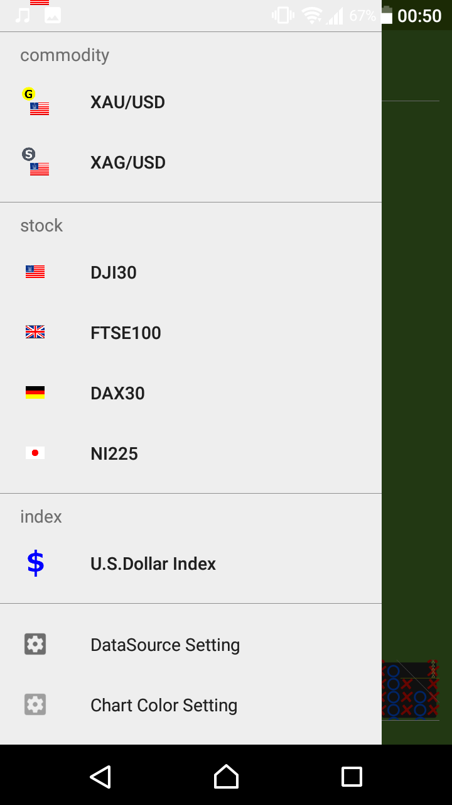

# Edit list for X-Axis margin 
`X-Axis margin list`is editable as you want.

- `6`values for`0.1`to`0.35`in this picture.
- It's defined for each data-source (rate pair).

* * *
[ < back to index page](index)

# How To

## 1. Open "DataSource Setting" window
Select`DataSource Setting`in`NavigationMenu`.

## 2. Select DataSource
Tap the DataSource's setting icon which you want change.

## 3. Tap the`EDIT BOX RATES`
Look at`box rates rows`. It's value for`0`at first.
Then`X-Axis margin list`in chart window is automatically by the system.
Tap the`EDIT BOX RATES`button.

## 4. Input values
`box rate`means`x-axis margin`.
Input value and tap the`'+'` button.
`'x'` button is remove value.

Does you inputted some value you want? Then tap the`OK`button.

## 5. Save settings
Look at`box rates rows`. Is it changed from`0`?
Tap the `SAVE` button.

## 6. Show chart
`X-Axis margin list`is changed by your setting.
Try choose these value.

That's all. thank you :)

* * *
[ < back to index page](index)