# Change chart colors
You can change color for charts and text.

[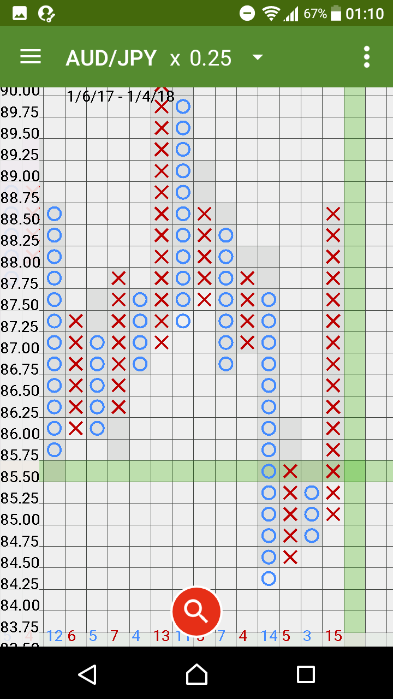](../assets/images/4color9.png)

* * *
[ < back to index page](index)

# How To

## 1. Open "Chart Color Setting" window
Select`Chart Color Setting`in`NavigationMenu`.

[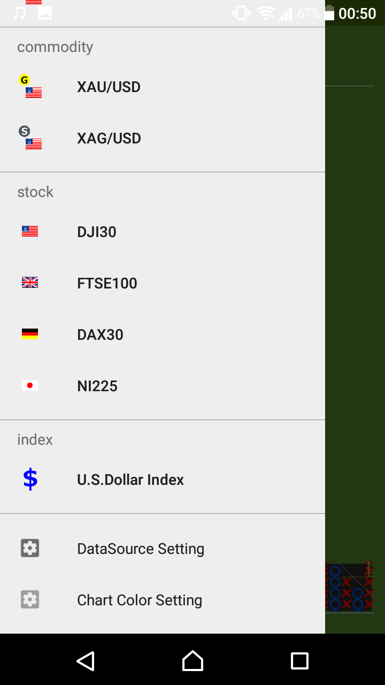](../assets/images/1main3.png)

## 2. Select column
Select column which you want change color.

[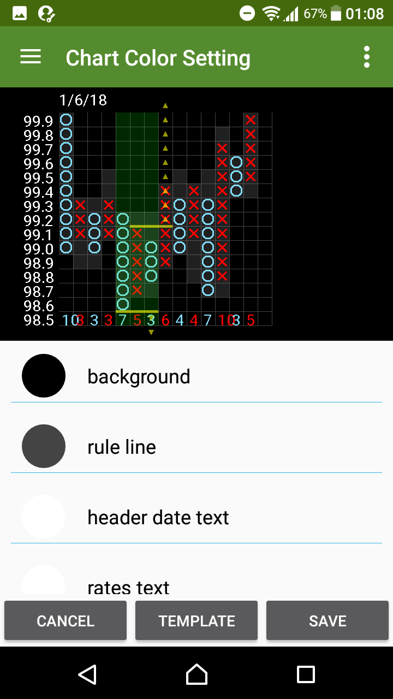](../assets/images/4color1.png)

## 3. Pick the color
Select color and tap the`ok`button.

[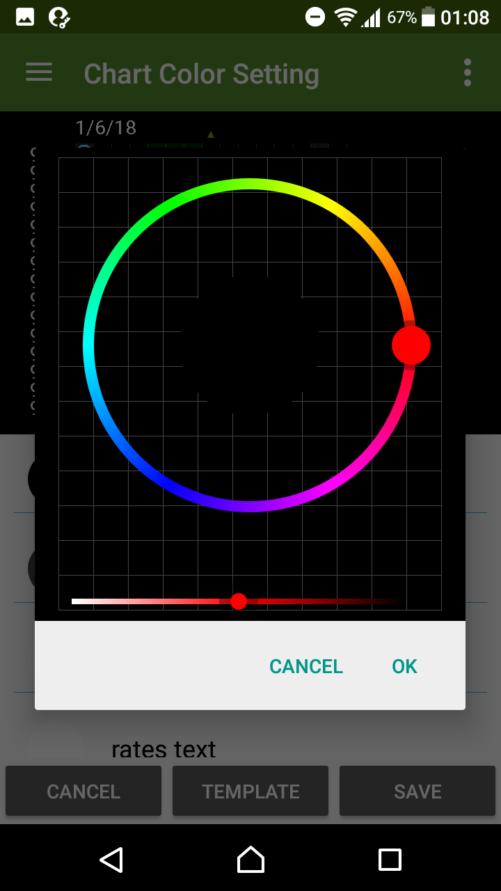](../assets/images/4color2.png)
[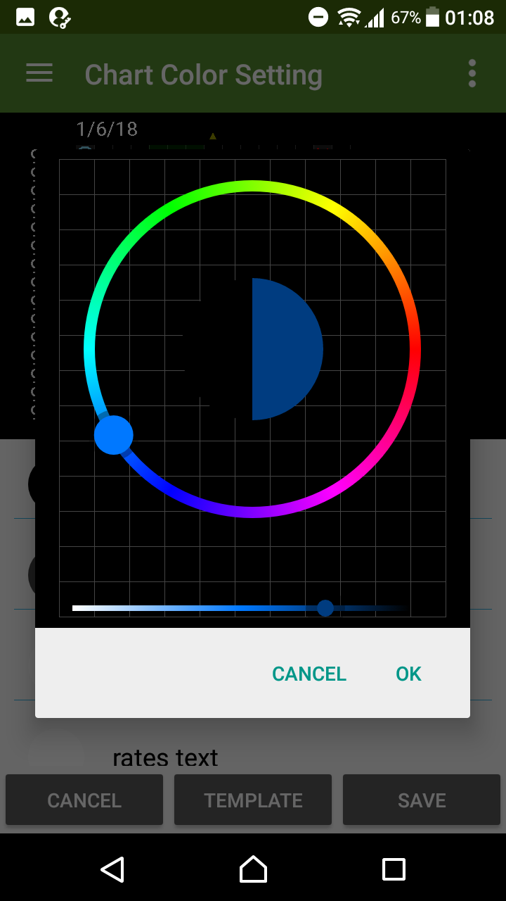](../assets/images/4color3.png)

## 4. Save settings
Change the color of several columns in the same way.
Tap the`SAVE`button.

[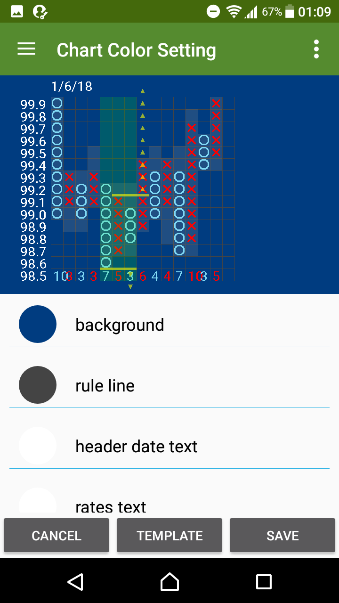](../assets/images/4color4.png)
[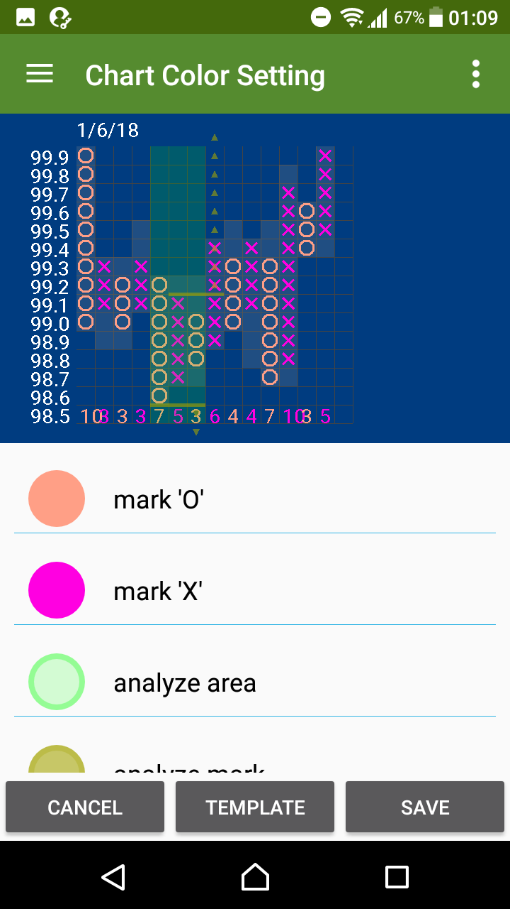](../assets/images/4color5.png)

## 5. Show chart

[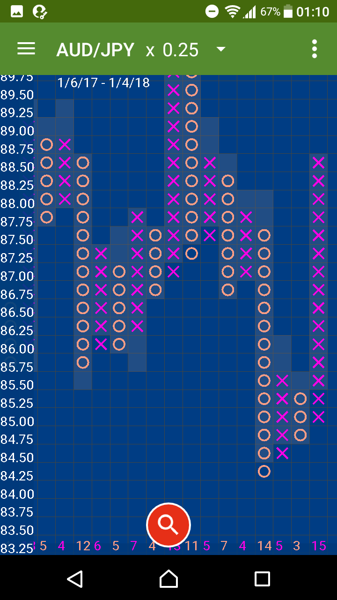](../assets/images/4color6.png)

* * *

# Use template settings

## 1. Tap the`TEMPLATE`button

## 2. Pick the theme
Pick the theme and tap the`SAVE`button.

| Theme       |                   |
|:------------|:------------------|
|`theme black`| Default color theme |
|`theme white`| The theme like a Grid paper |

[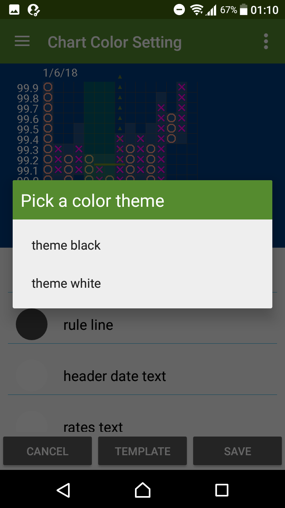](../assets/images/4color7.png)
[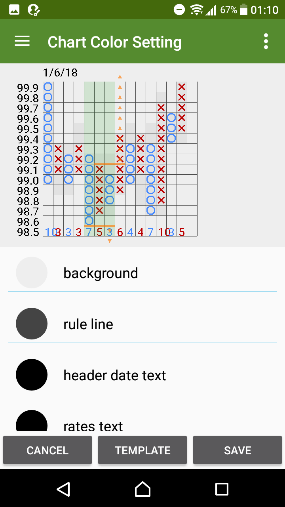](../assets/images/4color8.png)

## 3. Show chart

### Export`Jpeg Image` 
These settings affect`jpeg image`on`export`function.

[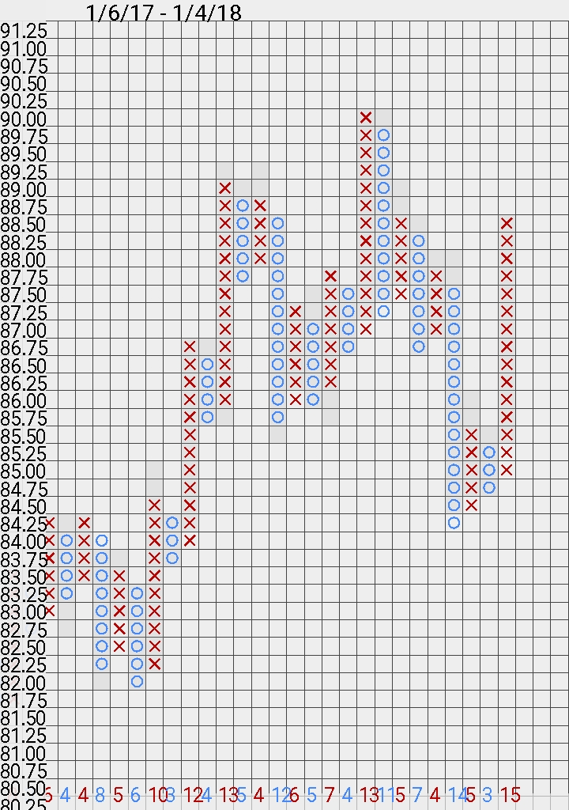](../assets/images/4colorA.jpg)

That's all. thank you :)
* * *
[ < back to index page](index)