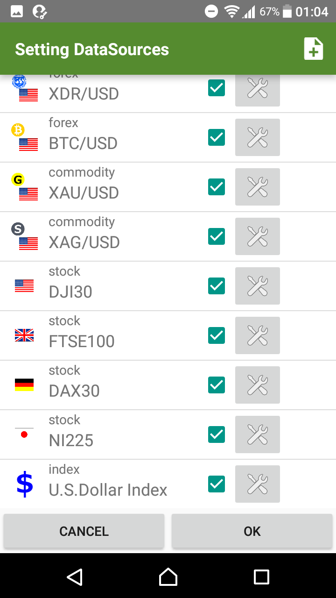
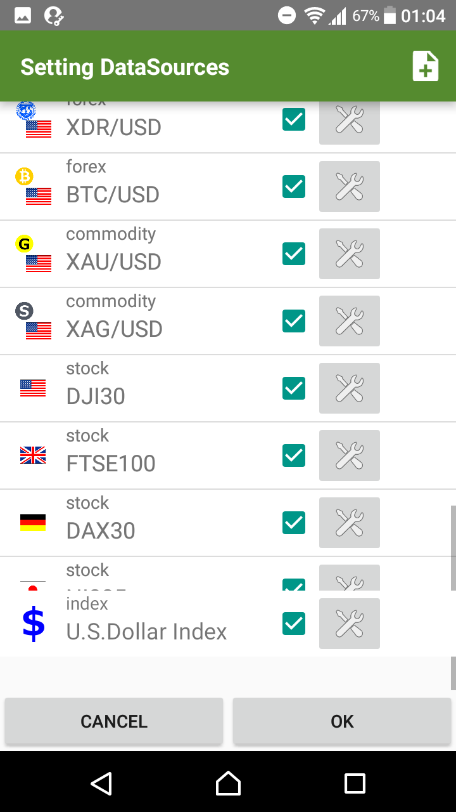
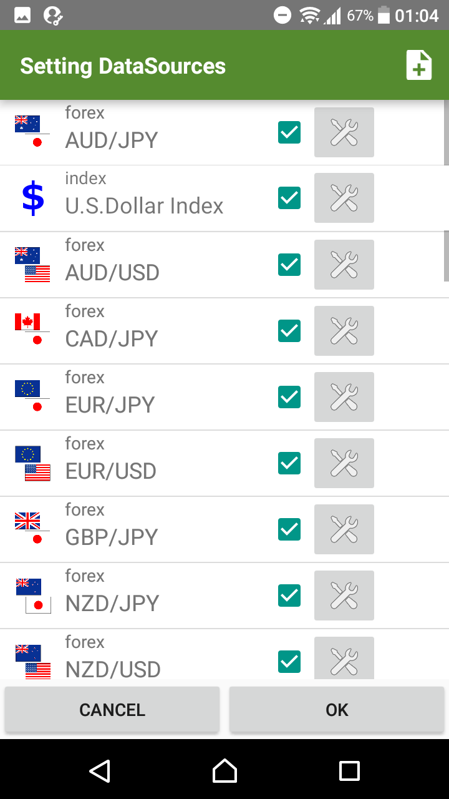
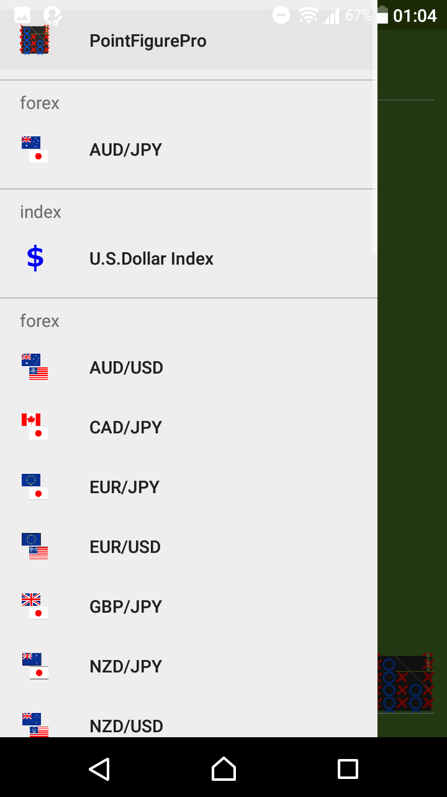
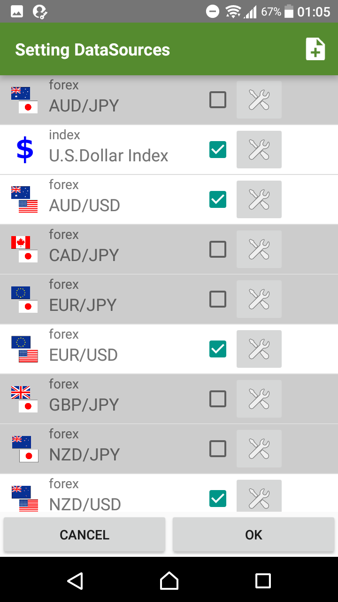
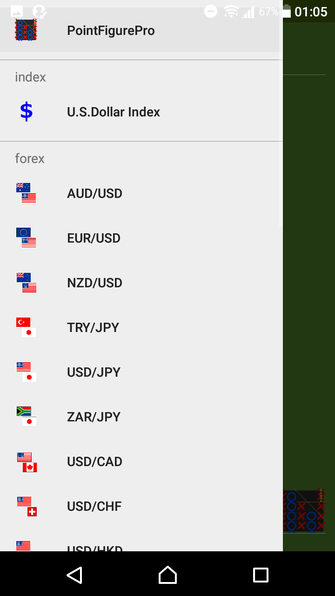

# DataSource list 
Introduce about`change sort order`and`hide unnecessaries`for DataSource list.

- `6`values for`0.1`to`0.35`in this picture.
- It's defined for each data-source (rate pair).

* * *
[ < back to index page](index)

# How To

## 1. Open "DataSource Setting" window
Select`DataSource Setting`in`NavigationMenu`.

## 2. Change sort order
Let's change sort order.
Now I will change`U.S. Dollar Index`to the 2nd from top.
Tap the`U.S Dollar Index`row and swipe above to 2nd position.

`U.S Dollar Index` is below the `AUD/JPY`

Tap the`OK`button and see the`NavigationMenu`.

## 3. Hide unnecessaries

Next, Let's hide unnecessary DataSouce.

tap the `'v'` button to switch hide and show.
Now I will show you hide 5 items (`AUD/JPY`,`CAD/JPY`,`EUR/JPY`,`GBP/JPY`,`NZD/JPY`)

Tap the`OK`button and see the`NavigationMenu`.

How is it ?

That's all. thank you :)

* * *
[ < back to index page](index)