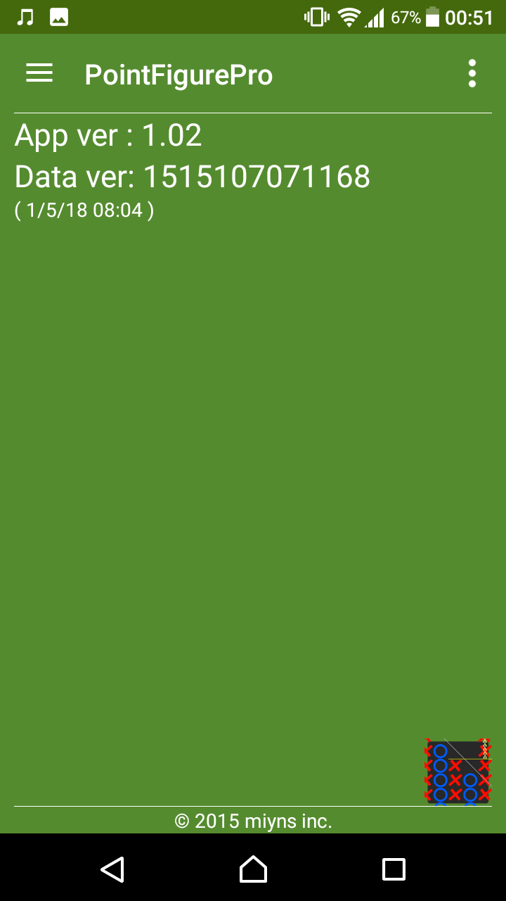
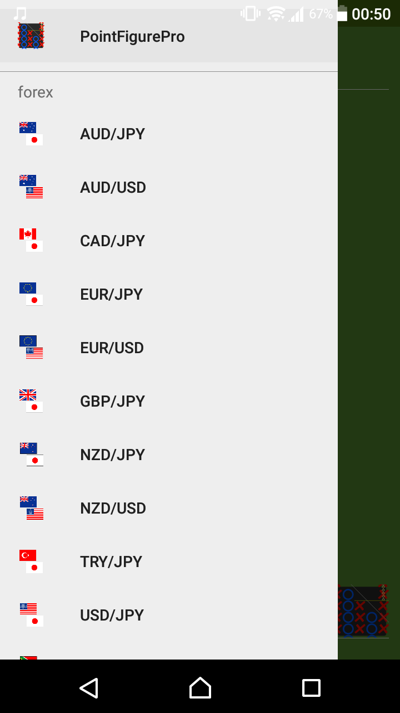

# Top and Menu page
Introduce about`Top page`and`NavigationMenu`.

## Top page

| column       |                      |
|:-------------|:---------------------|
| App ver      | Application version  |
| Data ver     | Current RateData version from server|

## Navigation Menu
- app icon for open the top page.
- `Rate pair` for open the `chart viewer`
- `Settings` on the bottom of list.

## Dialog Menu

| column        |                                  |
|:--------------|:---------------------------------|
| Contact us    | Launch mailer app                |
| Rate this app | go to GooglePlay web page        |
| Licenses      | Licenses for Library in this app |
| `OK`button    | Close dialog                     |

That's all. thank you :)

* * *
[ < back to index page](index)