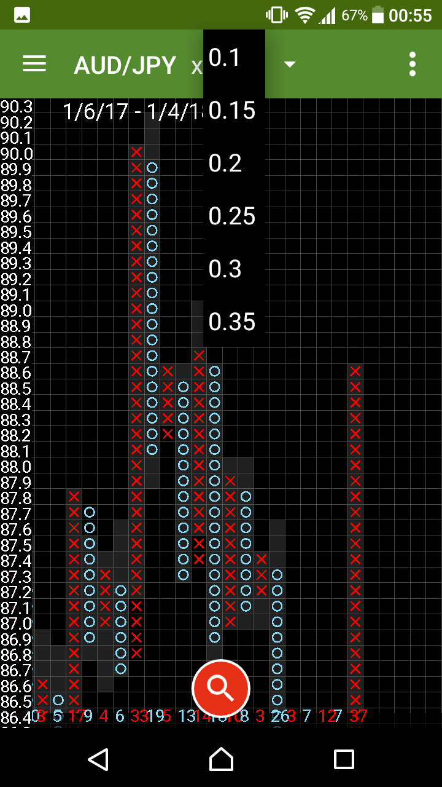

# View mode
Introduce about`view mode` in `Chart Viewer` page.

Choose `AUD/JPY` in `NavigationMenu`

This is `Chart Viewer`.
first, loupe's red icon on The bottom of page.
`loupe` means to `View mode`

`View mode` feature
- Swipe to scroll chart
- pinch-in/out to zoom-in/out
- tap the loupe when switch other mode

Next, `x 0.1` on The top of page.
It's X-Axis margin.
Tap the value and show.

That's all. thank you :)

* * *
[ < back to index page](index)